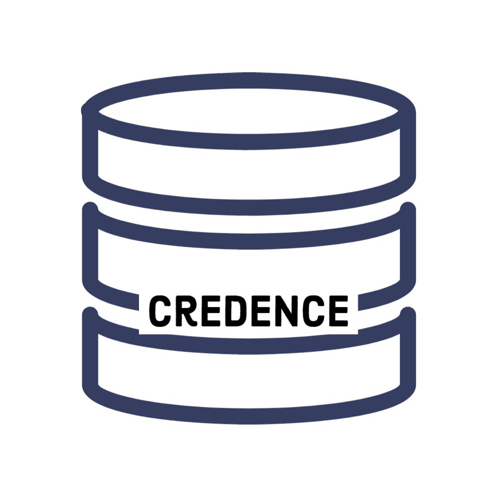

  
   
   
  ✦
   
   

## What is the purpose of Credence and how does it work?
[Credence](https://credence.0xprofile.space/) is a platform that simplifies tracking and verifying identity and reputation on **Optimism's AttestationStation** for developers and users.

It enables cross-chain attestation, breaking down barriers between different networks, and offers a user-friendly interface, by providing an easy-to-read dashboard, search feature, and graph visualizations.

## Features:

- User-friendly dashboard
- Search feature to quickly find attestation information
- Graph visualizations to better understand relationships and reputation
- Cross-chain attestation for seamless attestation across different networks
- Optimized data query with low latency using TheGraph

## How to use Credence Platform?

- Visit the Credence platform at [here](https://credence.0xprofile.space/)
- Enter the address you want to query in the search bar
- Use the dashboard to view attestation information and visualizations
- Use the search feature to quickly find specific attestation information
- Use the cross-chain attestation feature to make attestations across different networks (currently only support Goerli to Optimism Goerli)

## Technology Used:
- Frontend: Vite.js
- Web3 Integrations: Ethers.js, wagmi, and RainbowKit
- Smart Contracts: Solidity
- Backend Data Query: Custom GraphQL API built with TheGraph
- Cross-Chain Attest: Hyperlane.xyz's cross-chain messaging feature

## Getting Started

How to start this project can refer to this [starter-kit](https://github.com/ethereum-optimism/optimism-starter) provided by Optimism.

#### Cross-chain contract setup:
Cross-chain Attestation need to deploy separately to different network, but the Receiver.sol will always be on Optimism network

#### TheGraph API setup
Refers to our [OPAttest_Graph repo](https://github.com/0xProfile/OPAttest_Graph)